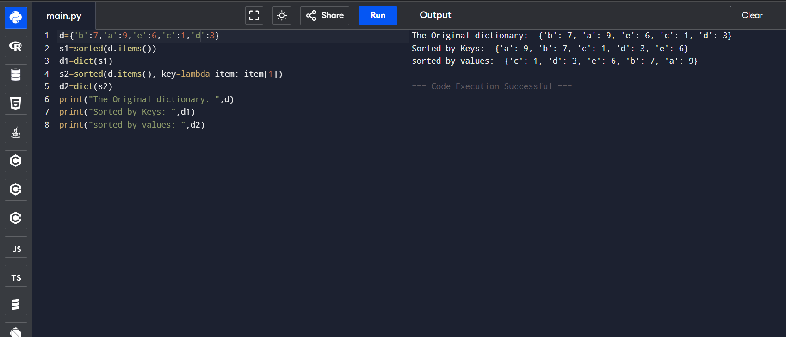

# 🔤 Dictionary-Python Program to Sort a Dictionary by Keys and Values

This Python program demonstrates how to sort a dictionary:
- Alphabetically by keys
- Alphabetically by values

---

## 🎯 Aim

To write a Python program that sorts a dictionary's:
- Keys in alphabetical order
- Values in alphabetical order

---

## 🧠 Algorithm

1. **Start the program.**
2. **Define** a dictionary with key-value pairs.
3. **Sort by Keys**:
   - Use `sorted(dictionary.items())`
   - Convert the result to a dictionary using `dict()`
4. **Sort by Values**:
   - Use `sorted(dictionary.items(), key=lambda item: item[1])`
   - Convert the result to a dictionary using `dict()`
5. **Display** the original and sorted dictionaries.
6. **End the program.**

---

## 🧪Program
```
d={'b':7,'a':9,'e':6,'c':1,'d':3}
s1=sorted(d.items())
d1=dict(s1)
s2=sorted(d.items(), key=lambda item: item[1])
d2=dict(s2)
print("The Original dictionary: ",d)
print("Sorted by Keys: ",d1)
print("sorted by values: ",d2)
```

## Sample Output

## Result
Hence the program executed and the output is verified
