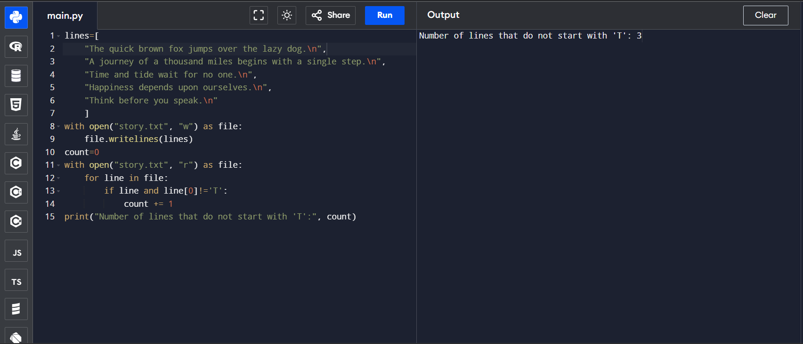

# File Handling in Python: Count Lines Not Starting with 'T'

## 🎯 Aim
To write a Python program that counts the number of lines in a text file `story.txt` that do **not** start with the alphabet `'T'`.

## 🧠 Algorithm
1. Open the file `story.txt` in **read mode**.
2. Initialize a counter `count` to zero.
3. Iterate through each line of the file:
   - Check if the first character of the line is **not** `'T'`.
   - If the line does not start with `'T'`, increment the `count` by 1.
4. After processing all lines, print the `count` value, which represents the number of lines that do not start with `'T'`.

## 🧾 Program
```
lines=[
    "The quick brown fox jumps over the lazy dog.\n",
    "A journey of a thousand miles begins with a single step.\n",
    "Time and tide wait for no one.\n",
    "Happiness depends upon ourselves.\n",
    "Think before you speak.\n"
    ]
with open("story.txt", "w") as file:
    file.writelines(lines)
count=0
with open("story.txt", "r") as file:
    for line in file:
        if line and line[0]!='T':
            count += 1
print("Number of lines that do not start with 'T':", count)
```

## Output

## Result
Hence the program executed and the output is verified