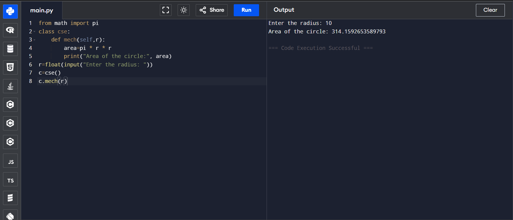
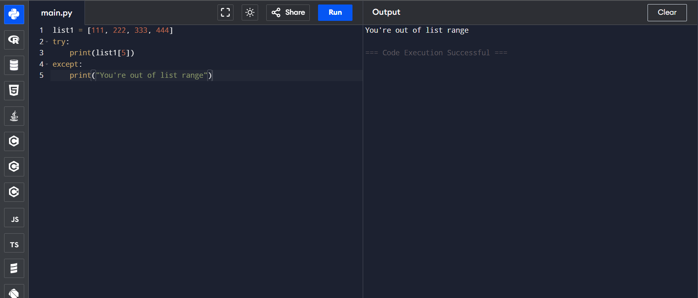
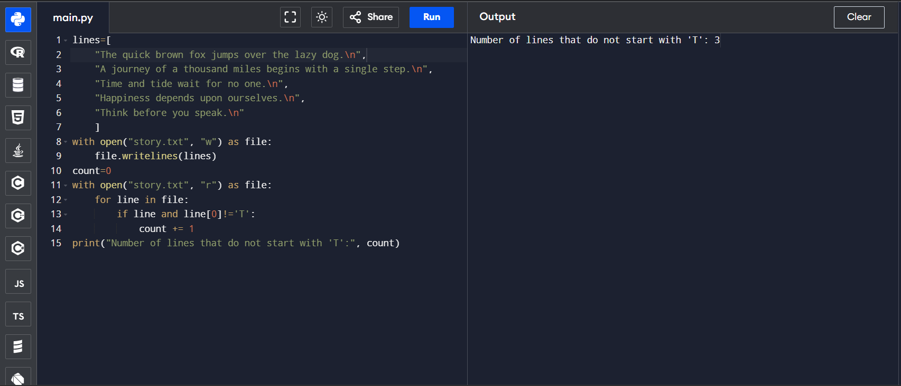

# Classes and Objects in Python: Calculate the Area of a Circle

## 🎯 Aim
To write a Python program that calculates the **area of a circle** based on the radius provided by the user. This program uses a class named `cse` and a method `mech` to perform the calculation.

## 🧠 Algorithm
1. **Get user input**: Take the radius of the circle as input from the user.
2. **Define the class**: Create a class named `cse`.
3. **Define the method**: Inside the class, define the method `mech` to calculate the area of the circle using the formula:  
   Area = pi *r^2 
4. **Execute the program**: Create an object of the class and call the method with the radius value.

## 🧾 Program
```
from math import pi
class cse:
    def mech(self,r):
        area=pi * r * r
        print("Area of the circle:", area)
r=float(input("Enter the radius: "))
c=cse()
c.mech(r)
```

## Output

## Result
Hence the program executed and the output is verified

## Dictionary Operations in Python: Merging Two Dictionaries

## 🎯 Aim
To write a Python program that merges **two dictionaries** and combines their key-value pairs.

## 🧠 Algorithm
1. Define two dictionaries `dict1` and `dict2` with some key-value pairs.
2. Define a function `merge()` that merges the two dictionaries using the `**` unpacking operator.
   - The merged result will combine keys from both dictionaries. If a key exists in both, the value from `dict2` will overwrite that from `dict1`.
3. Call the `merge()` function and print the merged dictionary.

## 🧾 Program
```
dict1={'key1': 1, 'key2': 2, 'key3': 3}
dict2={'key1': 4, 'key2': 5}
def merge():
    merged={**dict1, **dict2}
    print(merged)
merge()
```

## Output

## Result
Hence the program executed and the output is verified

# 🔤 Dictionary-Python Program to Sort a Dictionary by Keys and Values

This Python program demonstrates how to sort a dictionary:
- Alphabetically by keys
- Alphabetically by values

---

## 🎯 Aim

To write a Python program that sorts a dictionary's:
- Keys in alphabetical order
- Values in alphabetical order

---

## 🧠 Algorithm

1. **Start the program.**
2. **Define** a dictionary with key-value pairs.
3. **Sort by Keys**:
   - Use `sorted(dictionary.items())`
   - Convert the result to a dictionary using `dict()`
4. **Sort by Values**:
   - Use `sorted(dictionary.items(), key=lambda item: item[1])`
   - Convert the result to a dictionary using `dict()`
5. **Display** the original and sorted dictionaries.
6. **End the program.**

---

## 🧪Program
```
d={'b':7,'a':9,'e':6,'c':1,'d':3}
s1=sorted(d.items())
d1=dict(s1)
s2=sorted(d.items(), key=lambda item: item[1])
d2=dict(s2)
print("The Original dictionary: ",d)
print("Sorted by Keys: ",d1)
print("sorted by values: ",d2)
```

## Sample Output

## Result
Hence the program executed and the output is verified

# Exception Handling in Python: Avoiding Index Errors

## 🎯 Aim
To write a Python program that handles an **IndexError** when trying to access an element beyond the available range of a list.

## 🧠 Algorithm
1. Define a list `list1` with some integer elements.
2. Use a **try-except** block:
   - In the `try` block, attempt to access an index that is out of range (e.g., `list1[5]`).
   - In the `except` block, catch the error and print a custom message `"You're out of list range"`.
3. Print the result based on whether the index access succeeds or fails.

## 🧾 Program
```
list1 = [111, 222, 333, 444]
try:
    print(list1[5])
except:
    print("You're out of list range")
```

## Output

## Result
Hence the program executed and the output is verified

# File Handling in Python: Count Lines Not Starting with 'T'

## 🎯 Aim
To write a Python program that counts the number of lines in a text file `story.txt` that do **not** start with the alphabet `'T'`.

## 🧠 Algorithm
1. Open the file `story.txt` in **read mode**.
2. Initialize a counter `count` to zero.
3. Iterate through each line of the file:
   - Check if the first character of the line is **not** `'T'`.
   - If the line does not start with `'T'`, increment the `count` by 1.
4. After processing all lines, print the `count` value, which represents the number of lines that do not start with `'T'`.

## 🧾 Program
```
lines=[
    "The quick brown fox jumps over the lazy dog.\n",
    "A journey of a thousand miles begins with a single step.\n",
    "Time and tide wait for no one.\n",
    "Happiness depends upon ourselves.\n",
    "Think before you speak.\n"
    ]
with open("story.txt", "w") as file:
    file.writelines(lines)
count=0
with open("story.txt", "r") as file:
    for line in file:
        if line and line[0]!='T':
            count += 1
print("Number of lines that do not start with 'T':", count)
```

## Output

## Result
Hence the program executed and the output is verified
